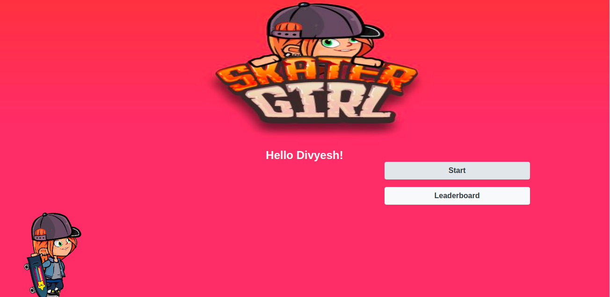

# Platform-Game: Endless Runner Game
 
> This is a Platform game that was created using Javascript, Phaser3 Library, and all the assets are obtained from [opengameart](https://opengameart.org/) website.
> The goal is to run as far as you can without hitting the obstacles.
 
### You can access a Live Demo [HERE](https://lucid-rosalind-9f9014.netlify.app/)
 

 
## Built With
 
- Javascript 
- Phaser3
- Webpack
- HTML5
- CSS3
- Bootstrap
- OpenGameArt Library
 
 
 
## Getting Started
 
To get a local copy up and running follow these simple steps.
 
- [ ] Open your terminal
- [ ]  Navigate to the directory where you will like to install the repo by running `cd FOLDER-NAME`
- [ ] Clone this repository
> `git clone https://github.com/Div685/Platform-Game-Skater-Girl.git`
- [ ] run `yarn install`
- [ ] run `yarn start:dev`
- [ ] Now run `index.html` file in your favorite browser.
 
## How to play the game
The game is very easy to play just follow the step:
 
- First Add your name to start the game

- press `start` button

- Click on `Play` to Star the game.

- To start the Game hit `SPACE BAR` on your keyboard
- Use `SPACEBAR` to Jump over the obstacles.
 
## Initial Objectives
> My initial objective for the first two days was to learn phaser3 library and get started with the initial setup (Creating template for the game), Add ground and background tilesprite. I ended up using 2 and half days to set up the template, ground, and background because it was a bit complicated at the beginning.
 
 
## Authors
 
👤 **Divyesh Patel**
 
- GitHub: [@Div685](https://github.com/Div685)
- Twitter: [@div_685](https://twitter.com/div_685)
- LinkedIn: [Divyesh Patel](https://www.linkedin.com/in/divyesh-daxa-patel/)
 
 
## 🤝 Contributing
 
Contributions, issues, and feature requests are welcome!
 
Feel free to check the [issues page](https://github.com/Div685/Platform-Game-Skater-Girl/issues).
 
 
## Show your support
 
Give a ⭐️ if you like this project!
 
## Acknowledgments
I would like to thank
- [OpenGameArt.ORG](https://opengameart.org/) for the wonderful gaming assets
- [phaser3 Library](http://phaser.io/)
- code Reviewer and anyone else who participated.
